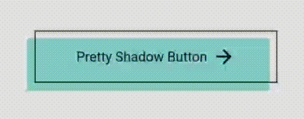
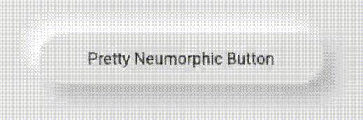
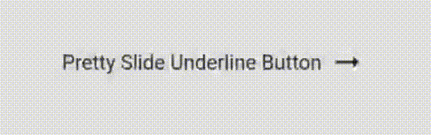
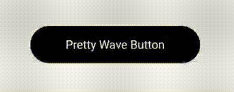
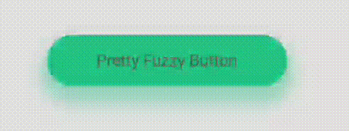
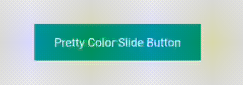
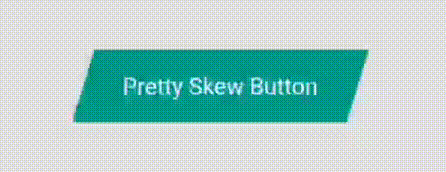
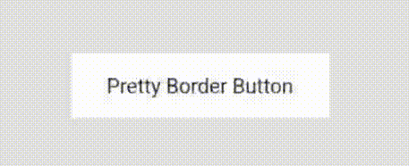
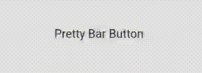
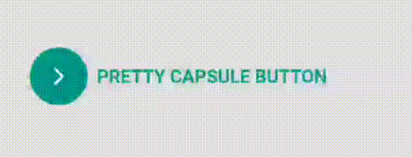

 # Pretty Animated Buttons

 ### Pretty Animated Buttons is a package for a collection of beautiful animated buttons which are highly customizable too. Currently, a total of 12 animated buttons are available. More fancy buttons are coming soon...


### Pretty Animated Buttons List

| Index | Pretty Buttons | Example  
| --- | ------- | ------ |
| 1 | Pretty Shadow Button |  |
| 2 | Pretty Neumorphic Button |  |
| 3 | Pretty Slide Underline Button |  |
| 4 | Pretty Wave Button |  |
| 5 | Pretty Fuzzy Button |  |
| 6 | Pretty Slide Icon Button |  |
| 7 | Pretty Slide Up Button |  |
| 8 | Pretty Color Slide Button |  |
| 9 | Pretty Skew Button |  |
| 10 | Pretty Border Button |  |
| 11 | Pretty Bar Button |  |
| 12 | Pretty Capsule Button |  |


## Usage
___

The usage is pretty simple. Just use the button's name in Pascal Case. 

Eg. For Pretty Shadow Button, use like this.

```dart
    PrettyShadowButton(
      label: "Pretty Shadow Button",
      onPressed: () {},
      icon: Icons.arrow_forward,
      shadowColor: Colors.green,
    ),
```

You can play around with tons of parameters. 

### Pretty Slide Icon Button

___

`PrettySlideIconButton` has two icon slide positions - left or right.

From left to right slide, 

```dart 
  slidePosition: SlidePosition.left,
```

From right to left slide,

```dart 
  slidePosition: SlidePosition.right,
```

### Pretty Color Slide Button

___


`PrettyColorSlideButton` has special parameter for sliding direction which is `position` parameter.

For left to right slide,
```dart
  position: SlidePosition.left
```
For right to left slide,
```dart
  position: SlidePosition.right
```
For top to bottom slide,
```dart
  position: SlidePosition.top
```
For bottom to top slide,
```dart
  position: SlidePosition.bottom
```

### Pretty Skew Button

____

`PrettySkewButton` also has left & right slide positions which can be tweaked via `skewPosition` parameter.

For left to right slide,
```dart 
  skewPosition: SkewPositions.left,
```
For right to left slide,
```dart 
  skewPosition: SkewPositions.right,
```

## Suggestions are welcome! ☕

 🚧🏗️ The project is under development.

 Feel free to try this out and give it a ⭐.

 More button suggestions are warmly welcome!. 
